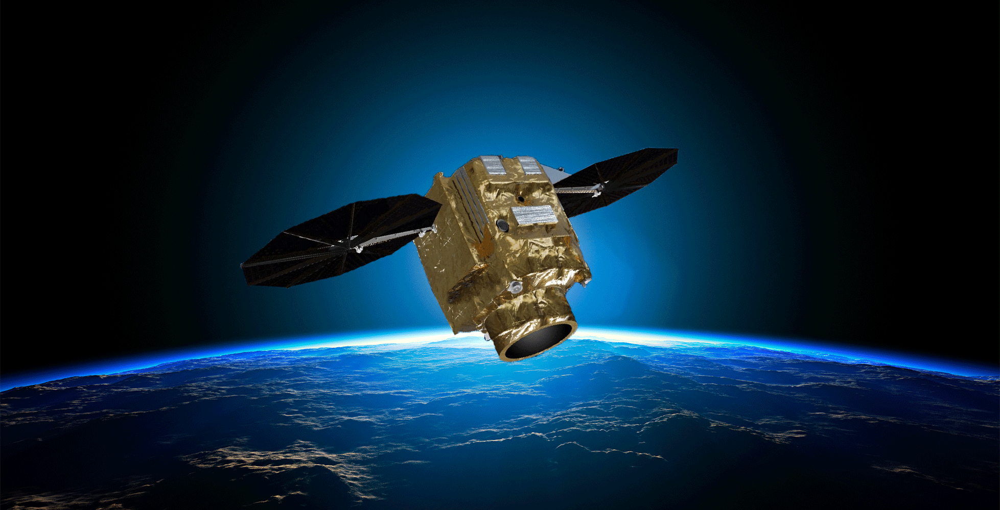
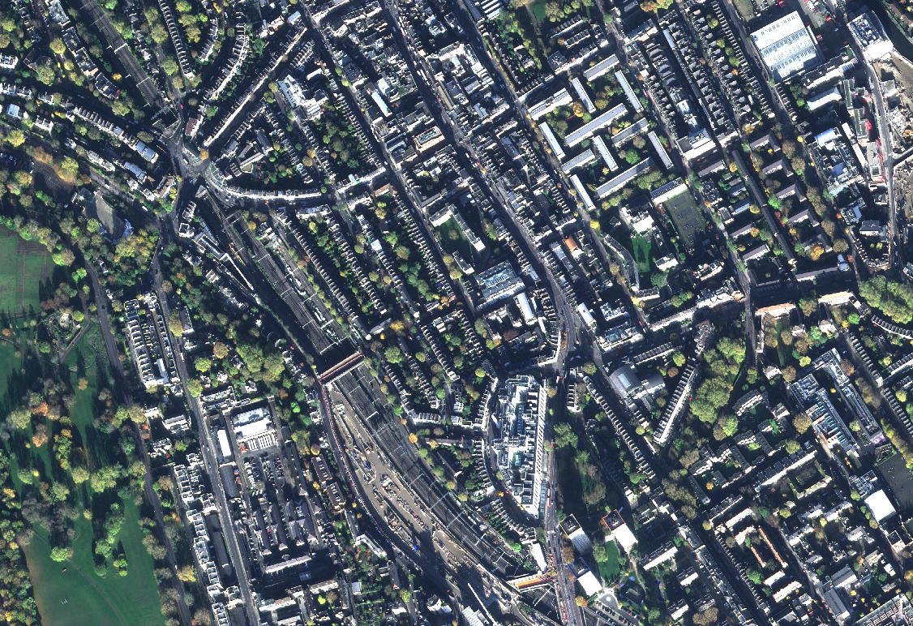
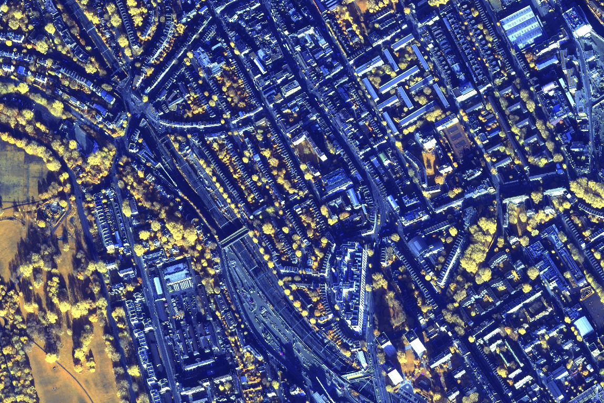
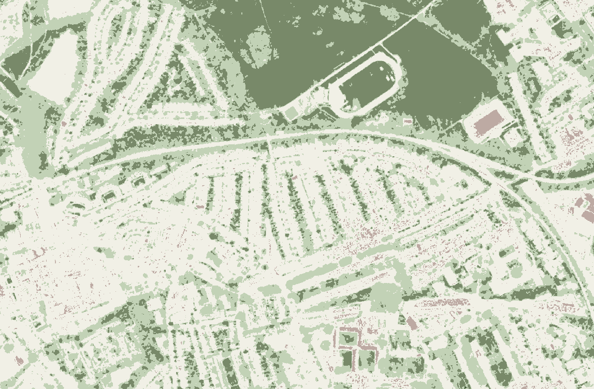
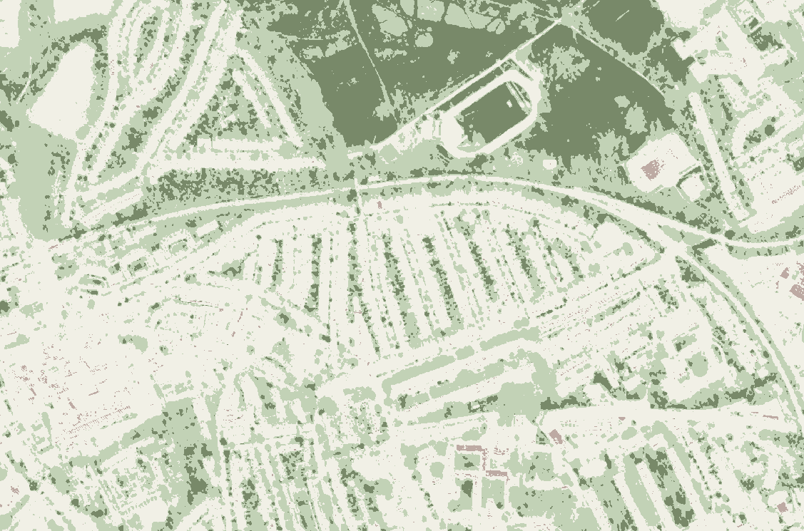
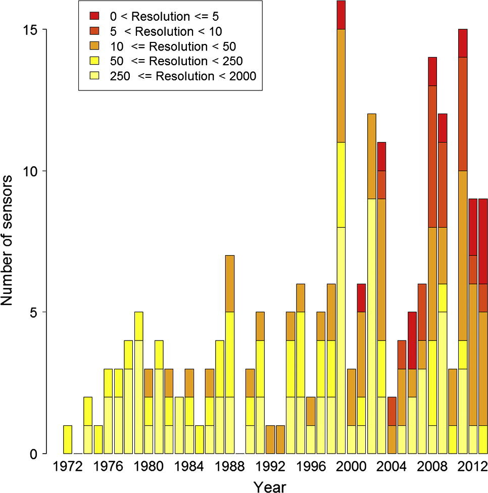

```{r, eval=TRUE, echo=FALSE}
library(RefManageR)

BibOptions(check.entries = FALSE,
           bib.style = "authoryear",
           cite.style = "authoryear",
           style = "markdown",
           hyperlink = TRUE,
           dashed = FALSE,
           no.print.fields=c("doi", "url", "urldate", "issn"))
myBib <- ReadBib("./references.bib", check = FALSE)

library(knitcitations)
```

# Pléiades Neo Overview
.pull-left[
Pléiades Neo is actually a constellation of two* identical satellites
  - Pléiades Neo 3 launched 28th April 2021 
  - Pléiades Neo 4 launched 16th August 2021
  
Very hi-resolution (VHR) commercial constellation, owned and operated by AirBus Defence and Space

Part of European Space Agency's third party missions
]
.pull-right[
Capacity to capture up to 1 million km2 of imagery per day

```{r echo=FALSE, out.width='75%', fig.align='center'}

```
]

.footnote[\* there are conflicting articles  `r Citet(myBib, "eoportal2023")` stating Pléiades Neo is actually a constellation of 4 satellites, however the official Airbus and European Space Agency websites state only 2 satellites]
---

#Technical Specification

.pull-left[
|   |   |
|---|---|
|Provider| Airbus Defence and Space |
|Satellites | 2 |
|Resolution| 30cm |
|Swath width| 14km |
|Bands| Panchromatic: 450-800nm |
|| Deep Blue 400-450nm |
|| Blue 450-520nm |
|| Red 620-690nm |
|| Red Edge 700-750nm |
|| Red 620-690nm |
|Coverage| 500 million sq km per day per satellite |
|Altitude| 620km |
|   |   |
]

.pull-right[
__Constraints of hi-res sensors__

Increased cost of capture and file size leading to increased storage and processing costs.

Swath width of hi-res sensor is smaller meaning more passes of the Earth are required to capture the same area which further increases costs.

| Sensor | Resolution | Swath Width |
|---|---|---|
|Pleiades Neo | Up to 0.3m |14km |
|Landsat-8 | Up to 15m | 185km |
|Sentinel 2 | Up to 10m | 185km |
`r Citet(myBib, "sce2022")`
]
---

# Use Cases

- Crisis Management
- Maritime Monitoring
- Agriculture
- Urban Planning
- Forestry
- Environmental Monitoring

There are many use cases for Pléiades Neo as shown above. 

These could be reviewed using sample images from the AirBus or ESA's website however in my work at London Borough of Camden we were lucky enough to take part in an EO Pilot scheme for the Public Sector which included access the Pleiades Neo images.

Therefore I can instead talk specifically about the Camden use case which looked at vegetation health. 

---

# Vegetation Health 1

.pull-left[
A simple RGB image to demonstrate the level of resolution available from Pléiades Neo.

Individual trees are clearly visible and when zooming in vehicles are also identifiable demonstrating the power of the sensor.

```{r echo=FALSE, out.width='100%'}

```
]
.pull-right[
We then produce an image using the Near-infrared, Edge-infrared and Deep Blue bands.

This helped to really highlight where vegetation is (yellows and greens) against the more urban areas (blue).  Smaller trees are now also identifiable that weren't clearly visible in the RGB image.

```{r echo=FALSE, out.width='100%'}

```
]

These images were useful for identification purposes however the issues we faced even at this level were due to technological constraints of hosting the data on shared drives and across networks.  Plus the computational power of the machines used were not ideal as processing was very slow. 
---

# Vegetation Health 2

The next step was to produce and compare a Normalised Difference Vegetation Index (NDVI) to understand vegetation health of the Borough between the two latest years available to us.

.pull-left[
```{r echo=FALSE, out.width='100%'}

```
NDVI image 2022]
.pull-right[
```{r echo=FALSE, out.width='100%'}

```
NDVI image 2023]

This allowed us to compare between the two years and see a clear drop in the vegetation health in the second year.

There could be a multitude of factors that caused this drop but these were not investigated as the main purpose of the pilot was to identify potential use cases rather than full analysis.

---

# Limitations 

At the time of the pilot Camden lacked the time, resource, technology and expertise to analyse the EO data in a timely manner.  As such this was as far as the pilot got so further temporal data could not accessed for further comparison.

Other issues we faced included accessing images for the right time of year. The images shown were from Autumn 2022 and 2023, therefore not the optimal time to accurately represent vegetation health.  Ideally images from Spring/early Summer would be used however the presence of excessive cloud cover in these images prevented their use.

---

# The future
### Pléiades Neo Next
.pull-left[
In April 2024 AirBus annouced the Pléiades Neo Next programme.

Few details are currently available but it Will provide native 20cm resolution imagery.

To launch in next few years and continue till at least 2040.

----
AirBus and others continue to push commercial EO capabilities with higher resolution capture.  This be seen by looking at the increase in high resolution sensors that are in orbit `r Citet(myBib, "belward2015")`
]

.pull-right[
```{r echo=FALSE, out.width='100%'}

```
]
---

# Reflection

Pléiades Neo is already a very powerful constellation and with Pléiades Neo Next to follow in the next few years with an increased resolution there is a clear trend to constant push to higher resolutions.

However, whilst increased spatial resolution is no doubt a good thing in certain cases we must be mindful of the use cases of such data.  For example for land use classification sub 20cm resolution is excessive. Whereas if we need to identify individual trees, vehicles then this increased resolution can bring greater accuracy to analysis and policy making.

There is work ongoing that aims to make higher resolution imagery more accessible, particularly in UK Local Government, so we could be seeing a shift to more EO based decision making in Local Government in the coming years. Although access to data is one thing and possessing and implementing the skills to effectively make use of this is another issue entirely.

---

#References
```{r, results='asis', eval=TRUE, echo=FALSE}
PrintBibliography(myBib)
```